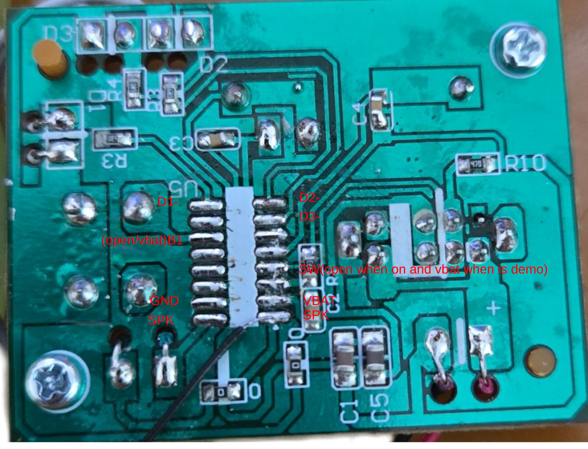
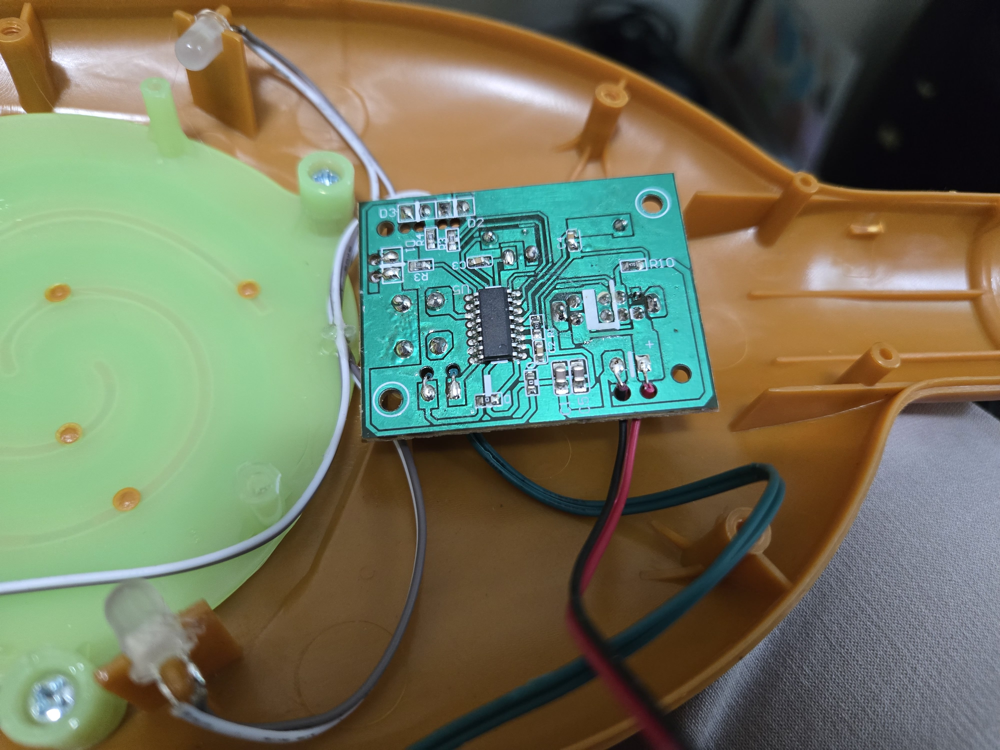
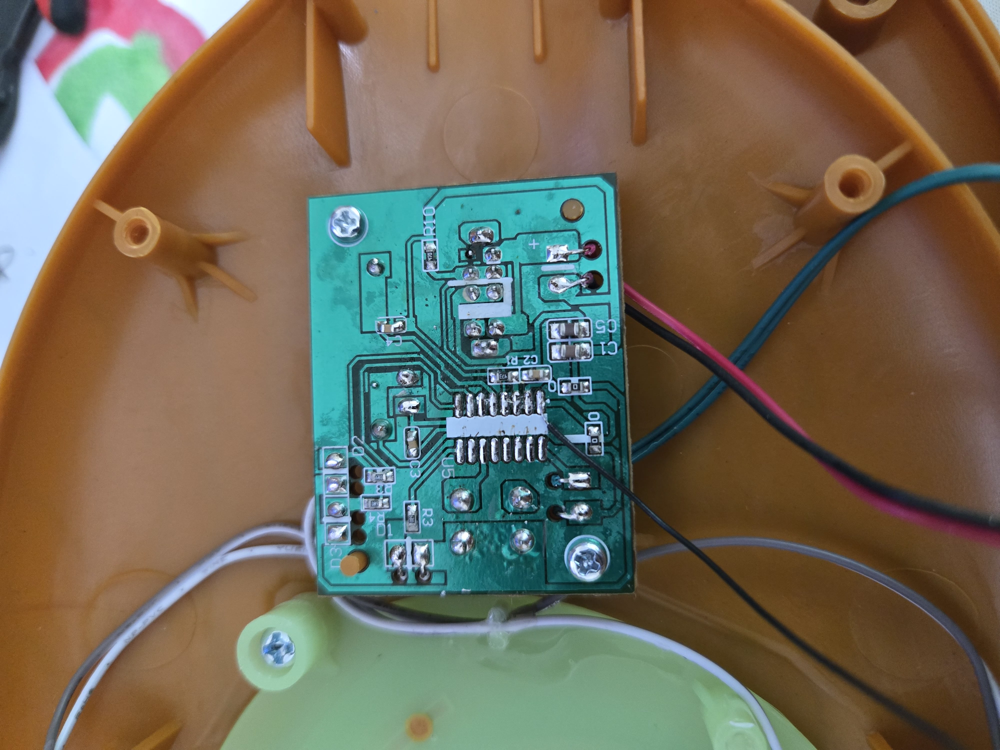
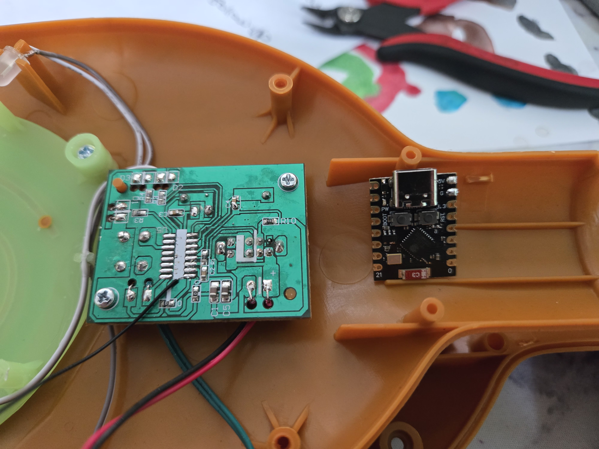
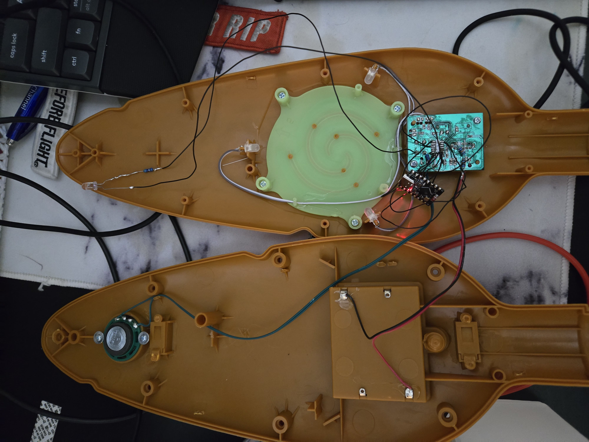

# 🌊 Moana's REALLY Magical Oar

> **When your 5-year-old wants REAL magic!** - We took Moana's Magical Oar toy and made it *actually* magical by adding the power to turn off TVs and flood nearby devices with fake Bluetooth notifications. Because if the ocean chose you, you deserve proper pranking powers! 🐚✨

[](https://youtube.com/shorts/QWM0_4KHsHc)

## 📋 Table of Contents

- [Overview](#-overview)
- [Features](#-features)
- [Hardware](#-hardware)
- [Project Gallery](#-project-gallery)
- [Software Dependencies](#-software-dependencies)
- [Installation & Setup](#-installation--setup)
- [Usage](#-usage)
- [Technical Details](#-technical-details)
- [Contributing](#-contributing)
- [License](#-license)
- [Acknowledgments](#-acknowledgments)

## 🐚 Overview

**Moana's REALLY Magical Oar** started as a simple Disney toy - "Moana's Magical Oar" - that made sounds and lights when my 5-year-old daughter pressed it. But she wanted REAL magic! So naturally, what any reasonable parent would do is gut the electronics and replace them with an ESP32-C3 to give it actual supernatural powers. 🏝️

This hardware modification project transforms the innocent Disney toy into a powerful technological marvel that combines:

- **🌊 Universal TV Remote** - Cycles through comprehensive IR codes to turn off most TVs (because the ocean controls all screens now!)
- **🐠 Bluetooth LE Spam** - Floods nearby devices with fake Apple AirPods, Samsung Galaxy Buds, and Android Fast Pair notifications
- **🌴 Magical LED Effects** - Uses the toy's original LEDs for visual feedback and enchanting animations worthy of Te Fiti herself
- **⚓ Dual Operation Modes** - Switch between prank mode and OTA update mode

Perfect for when your little Moana fan wants to demonstrate that she really CAN command the digital seas! Also great for harmless pranks, tech demonstrations, or educational purposes. 🐙

## ⭐ Features

### 🔥 IR Blasting Capabilities (The Power of Te Ka!)
- **Universal TV Power-Off**: Supports 20+ TV brands including Samsung, LG, Sony, Panasonic, Philips, Sharp, Toshiba, Vizio, Hisense, and TCL
- **Cyclical Code Transmission**: Automatically cycles through all IR codes until target device responds
- **Multiple IR Protocols**: NEC, Samsung, Sony, RC6, and Sharp protocols supported

### 📡 Bluetooth LE Spoofing (Tamatoa's Treasure Confusion!)
- **Apple Device Spam**: Triggers pairing notifications for AirPods, AirPods Pro, AirPods Max, PowerBeats, and more
- **Samsung Galaxy Buds**: Spams Samsung device notifications
- **Android Fast Pair**: Triggers Android pairing notifications for popular headphones
- **Aggressive Timing**: 30ms intervals for maximum effectiveness (faster than Maui's shapeshifting!)

### 🥥 User Interface (Heart of Te Fiti Controls)
- **Short Press** (< 3 seconds): Runs for 10 seconds automatically
- **Long Press** (≥ 3 seconds): Runs continuously while button is held
- **Mode Switch**: Toggle between Prank Mode and Demo/OTA Mode
- **Original LED Feedback**: Uses the toy's existing LEDs for visual indicators (glows like the heart of Te Fiti!)

### ⚓ Technical Features (Maui's Hook Engineering)
- **Over-The-Air Updates**: Wireless firmware updates via custom WiFi AP
- **Watchdog Protection**: Hardware watchdog prevents system lockups
- **Optimized Performance**: Hardware PWM for original toy LEDs, efficient memory usage
- **Dual Core Utilization**: Leverages ESP32-C3's capabilities

## 🐠 Hardware

### Core Components (Ingredients for Real Magic! 🍲)
- **[ESP32-C3 Super Mini](https://amzn.to/4ezUmzp)** - Main microcontroller (the new heart of Te Fiti!)
- **[IR LED](https://amzn.to/4eyGV2R)** - 940nm infrared transmitter (Te Ka's fire power!)
- **[Original Moana's Magical Oar](https://amzn.to/4lgTWke)** - Modified Disney toy host platform with original LEDs, button, and switch (Pua approved! 🐷)
- **[39Ω Resistor](https://amzn.to/44hQZKd)** - Current limiting for IR LED (CRITICAL for ESP32 protection! ⚠️)
- **[2x 100kΩ Resistors](https://amzn.to/44hQZKd)** - Voltage divider for mode switch (REQUIRED to prevent damage! ⚠️)
- **[10kΩ Resistor](https://amzn.to/44hQZKd)** - Pulldown resistor for push button (REQUIRED for reliable operation! ⚠️)

### Pin Configuration
```
GPIO 2  - IR LED (Transmitter) + 39Ω current limiting resistor
GPIO 3  - Push Button (Original toy button with 10kΩ pulldown resistor)
GPIO 4  - LED 2 (Green) - Original toy LED
GPIO 5  - LED 3 (Blue) - Original toy LED
GPIO 6  - LED 1 (Red) - Original toy LED
GPIO 7  - Mode Switch (Original toy switch through 100kΩ voltage divider!)
GPIO 8  - Debug LED

ESP32-C3 Power Connections:
5V    - Connect to VBAT from original PCB
3.3V  - Power source for original toy LEDs (after removing original VBAT resistor)
GND   - Common ground
```

### 🔥 CRITICAL HARDWARE MODIFICATIONS (Te Ka's Fire Safety!)

⚠️ **DANGER - FOLLOW THESE STEPS OR RISK DAMAGING YOUR ESP32-C3!** ⚠️

1. **Power Connection**: 
   - Connect original PCB's **VBAT** to ESP32-C3 **5V input**
   - **REMOVE** the resistor connecting VBAT to buttons/LEDs on original PCB
   - Use ESP32-C3's **3.3V output** to power the original toy LEDs

2. **Mode Switch Voltage Divider** (MANDATORY! 🚨):
   - Add **two 100kΩ resistors** in series as voltage divider
   - This reduces switch voltage from 5V to ~2.3V
   - Without this, you **WILL damage** the ESP32-C3!

3. **IR LED Current Limiting**:
   - Add **39Ω resistor** in series with IR LED
   - Protects both LED and ESP32-C3 GPIO
   - Any similar value (30-50Ω) will work

4. **Push Button Pulldown** (REQUIRED! 🚨):
   - Add **10kΩ pulldown resistor** from GPIO 3 to GND
   - Ensures reliable button state detection
   - Without this, button readings will be unreliable!

### Original PCB Pinout Reference 🗺️

*Study this pinout carefully before making any connections! This is your treasure map! 🏴‍☠️*

### Power Requirements
- **Input Voltage**: 5V (from original toy's VBAT)
- **Logic Voltage**: 3.3V (ESP32-C3 native)
- **Current**: ~200mA peak (during IR transmission)
- **Battery Life**: Varies based on usage pattern

## 🌺 Project Gallery

### Original Moana's Magical Oar 🌺

*The innocent Disney "Moana's Magical Oar" toy before we gave it REAL powers! 🏝️*

### Original PCB Pinout (The Treasure Map! 🗺️)

*CRITICAL REFERENCE: Study this pinout before making ANY connections! This will save your ESP32-C3 from Te Ka's wrath! 🔥⚠️*

### PCB After MCU Removal (The Sacrifice to Te Ka!) 🌋

*PCB after carefully removing the original microcontroller - sometimes you have to break things to make them truly magical! 🌋*

### ESP32-C3 Integration (The New Heart of Te Fiti!) 💚

*ESP32-C3 Super Mini ready to breathe new life into Moana's oar ⭐*

### Final Assembly (The Ocean's Chosen Technology!) 🌊

*Complete assembly - now my daughter's oar has REAL magical powers! 🌊✨ (Pua would be proud! 🐷)*

### Live Demo (See the Magic in Action!) 🥥
[](https://youtube.com/shorts/QWM0_4KHsHc)

## 🐠 Software Dependencies

This project builds upon several excellent open-source libraries and projects (like gathering the perfect ingredients for Gramma Tala's soup! 🍲):

### Core Libraries
- **[Arduino Core for ESP32](https://github.com/espressif/arduino-esp32)** - ESP32 Arduino framework
- **[IRremoteESP8266](https://github.com/crankyoldgit/IRremoteESP8266)** by crankyoldgit - Comprehensive IR library for ESP8266/ESP32
- **[PlatformIO](https://platformio.org/)** - Advanced embedded development platform

### Referenced Projects
- **[EvilAppleJuice-ESP32](https://github.com/ckcr4lyf/EvilAppleJuice-ESP32)** by ckcr4lyf - BLE spam implementation for Apple devices
- **[TCL TV IR Codes](https://gist.github.com/DDRBoxman/c0c009bb50c43a0e777abe77f9e00cf9)** by DDRBoxman - TCL TV remote codes
- **[ESP32 BLE Libraries](https://github.com/nkolban/esp32-snippets)** - Bluetooth Low Energy implementation

### Development Tools
- **[PlatformIO IDE](https://platformio.org/platformio-ide)** - Development environment
- **[ESP32 Arduino Core](https://docs.espressif.com/projects/arduino-esp32/)** - Hardware abstraction layer

## 🚢 Installation & Setup

### Prerequisites (Gather Your Voyaging Supplies! ⛵)

⚠️ **CRITICAL COMPONENTS - DO NOT SKIP THESE!** ⚠️

1. **PlatformIO** installed in VS Code or as standalone
2. **ESP32-C3 Super Mini development board** - The heart of Te Fiti! 💚
3. **[Moana's Magical Oar toy](https://amzn.to/4lgTWke)** - The vessel that will receive real magic! 🌊
4. **[IR LED](https://amzn.to/4eyGV2R)** (940nm recommended) - Your digital fire! 🔥
5. **39Ω Resistor** - MANDATORY for IR LED current limiting ⚡
6. **2x 100kΩ Resistors** - ESSENTIAL voltage divider (prevents ESP32-C3 damage!) 🚨
7. **10kΩ Resistor** - REQUIRED pulldown for push button (ensures reliable operation!) ⚡
8. **Soldering equipment** and multimeter for testing
9. **Original PCB pinout reference** (see Project Gallery above!)

### Hardware Assembly (The Sacred Ritual! 🌋)

⚠️ **READ ALL STEPS BEFORE STARTING - IMPROPER ASSEMBLY WILL DAMAGE YOUR ESP32-C3!** ⚠️

1. **Study the Original PCB** 📜:
   - Examine the pinout diagram above carefully
   - Identify VBAT, LED connections, button/switch pins
   - Take photos for reference before modifications

2. **Remove Original MCU** 🔥:
   - Carefully desolder the original microcontroller from the toy
   - Clean the PCB pads thoroughly
   - **CRITICAL**: Remove the resistor connecting VBAT to buttons/LEDs

3. **Prepare Voltage Divider** ⚡:
   - Solder two 100kΩ resistors in series
   - Connect to mode switch and GPIO 7
   - This creates ~2.3V from 5V input (ESSENTIAL for ESP32-C3 safety!)

4. **Power Connections** 🔌:
   - Connect original PCB's **VBAT** → ESP32-C3 **5V**
   - Connect ESP32-C3 **3.3V** → Original toy LED power (where old VBAT resistor was)
   - Connect **GND** pins together

5. **Install IR LED** 🔥:
   - Mount 940nm IR LED with **39Ω current limiting resistor**
   - Connect to GPIO 2 through the resistor
   - Without resistor = dead ESP32-C3!

6. **Connect Original LEDs** 🌈:
   - Wire toy's original LEDs to GPIO 4, 5, 6 (preserving original current limiting resistors)
   - Power from ESP32-C3's 3.3V output, NOT original VBAT

7. **Wire Original Controls** 🎮:
   - Button: Connect original toy button to GPIO 3 with 10kΩ pulldown resistor to GND
   - Mode Switch: Connect original toy switch through voltage divider to GPIO 7

8. **Final Testing** 🧪:
   - Double-check all connections against pinout diagram
   - Verify voltage levels with multimeter before first power-up
   - Test with simple LED blink before full firmware

### Software Installation

1. **Clone the Repository**
   ```bash
   git clone https://github.com/yourusername/Moana_magic_pedal.git
   cd Moana_magic_pedal
   ```

2. **Install Dependencies**
   PlatformIO will automatically install all required libraries from `platformio.ini`

3. **Build and Upload**
   ```bash
   pio run --target upload
   ```

4. **Monitor Serial Output** (optional)
   ```bash
   pio device monitor
   ```

## 🌺 Usage

### Basic Operation (How to Command the Ocean!) 🌊

1. **Power On**: Insert batteries into the original toy housing
2. **Mode Selection**: Use the toggle switch to select operation mode:
   - **Prank Mode**: Full BLE spam + IR blasting
   - **Demo Mode**: Reduced intensity for demonstrations

3. **Activation**:
   - **Short Press** (< 3 seconds): Runs for 10 seconds automatically
   - **Long Press** (≥ 3 seconds): Runs continuously while button is held

4. **LED Indicators**:
   - **Red**: IR transmission active (Te Ka's fire! 🔥)
   - **Green**: BLE operations active (Heart of Te Fiti! 💚)
   - **Blue**: System ready/idle (Ocean's depth! 🌊)

### Over-The-Air Updates (Maui's Shapeshifting Magic! 🪝)

1. Set mode switch to Demo/OTA position
2. Power on the device
3. Connect to WiFi network "MoanaOar-OTA"
4. Upload new firmware via web interface at 192.168.4.1

### Safety Guidelines (Gramma Tala's Wisdom! 👵)

- **Use Responsibly**: This is a prank device - use with friends who will appreciate the humor
- **Respect Privacy**: Don't use in sensitive locations or against unwilling participants
- **Check Local Laws**: BLE spam may violate regulations in some jurisdictions
- **Battery Safety**: Remove batteries when not in use for extended periods

## 🐙 Technical Details (Maui's Engineering Secrets!)

### IR Protocol Support (Te Ka's Fire Languages! 🔥)
The device supports multiple IR protocols with comprehensive code coverage:

**Supported TV Brands**: Samsung, LG, Sony, Panasonic, Philips, Sharp, Toshiba, Vizio, Hisense, TCL, and more

**IR Protocols**:
- NEC (most common)
- Samsung proprietary
- Sony SIRC
- RC6 (Philips)
- Sharp

### BLE Advertisement Details (Tamatoa's Shiny Data! ✨)

**Apple Device Targets**:
- AirPods (1st, 2nd, 3rd gen)
- AirPods Pro (1st, 2nd gen)
- AirPods Max
- PowerBeats Pro
- Beats Solo Pro

**Android Fast Pair**:
- Popular headphone models
- Generic BLE device advertisements

### Memory and Performance
- **Flash Usage**: ~800KB (plenty of room for expansion!)
- **RAM Usage**: ~150KB during operation
- **CPU Usage**: ~30% during active BLE spam
- **Power Consumption**: 50-200mA depending on activity

## 🌊 Contributing

Want to add more magic to the oar? Contributions are welcome! Here's how you can help:

1. **Fork the repository**
2. **Create a feature branch** (`git checkout -b feature/new-magic`)
3. **Commit your changes** (`git commit -am 'Add some magic'`)
4. **Push to the branch** (`git push origin feature/new-magic`)
5. **Create a Pull Request**

### Ideas for Contributions
- Additional IR codes for more TV brands
- New BLE spam targets
- Enhanced LED animations
- Web-based configuration interface
- Battery level monitoring

## 🐚 License

This project is released under the MIT License. See `LICENSE` file for details.

**Additional Disclaimers**:
- Use responsibly and in compliance with local laws
- Not affiliated with Disney or Moana franchise
- Educational and entertainment purposes only
- Author not responsible for any misuse or damage

## 🌺 Acknowledgments

Special thanks to the amazing open-source community (the true voyagers of the digital ocean!) 🌊:

- **crankyoldgit** for the incredible IRremoteESP8266 library
- **ckcr4lyf** for the EvilAppleJuice-ESP32 project inspiration
- **DDRBoxman** for the comprehensive TCL TV IR codes
- **Espressif** for the powerful ESP32-C3 platform
- **The PlatformIO team** for making embedded development a joy
- **My 5-year-old daughter** for inspiring this ridiculous project in the first place! 🏝️

---

*"The ocean calls you, Moana!" - And now it can also turn off your TV! 🌊📺*

**Made with ❤️ and way too much caffeine by a parent who takes toy modification requests very seriously** ☕

*P.S. - Pua thinks this project is nuts, but Heihei would definitely approve! 🐷🐓*
